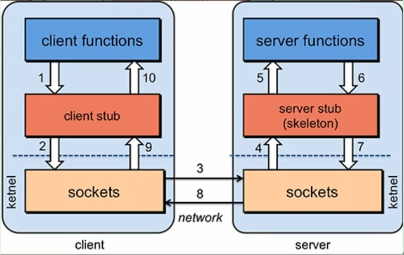

# dubbo

## 一、基础知识

### 1.分布式基础理论

+ 分布式系统

建立在网络之上的多个多个独立计算机的集合，对用户来说只看到了一个系统

+ 单一架构模式 ORM

一个项目多个应用打包部署到一台服务器

缺点：扩展性差，扩展性能瓶颈

+ 垂直应用架构 MVC

将应用分开部署

优点：容易分工合作，容易性能扩展

缺点：页面和业务逻辑耦合，改页面也要重新部署；应用不可能完全独立，大量的应用之间需要交互

+ 分布式服务架构 RPC

将 web 和 service 分离，接入层和中间层

缺点：资源浪费

+ 流动计算架构 SOA

调度中心，基于访问压力实时管理集群，提高利用率

+ RPC：远程过程调用，进程间通信

dubbo hsf grpc thrift

### 2.dubbo核心概念

https://dubbo.apache.org/zh/

service 放到注册中心，管理调度

+ 设计架构

register：dubbo 推荐 zookeeper，解压后运行 .cmd 文件

admin 管理控制台：从 github 下载，mvn clean package，java -jar

，monitor：

##